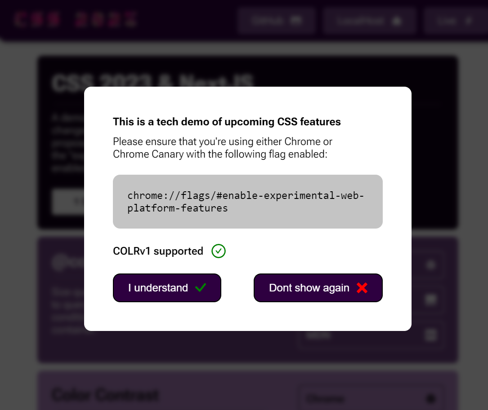

# GotPop Starter

An @container query & Next.js based component system. Uses draft CSS properties so should only be viewed in Chrome Canary with "Experimental Web Platform" flag enabled.

<h1 align="center">
	
</h1>

## Source article

https://web.dev/state-of-css-2022

## Live example

https://gotpop-starter.vercel.app

## Local

http://localhost:3000

## Vercel

https://vercel.com/dashboard

