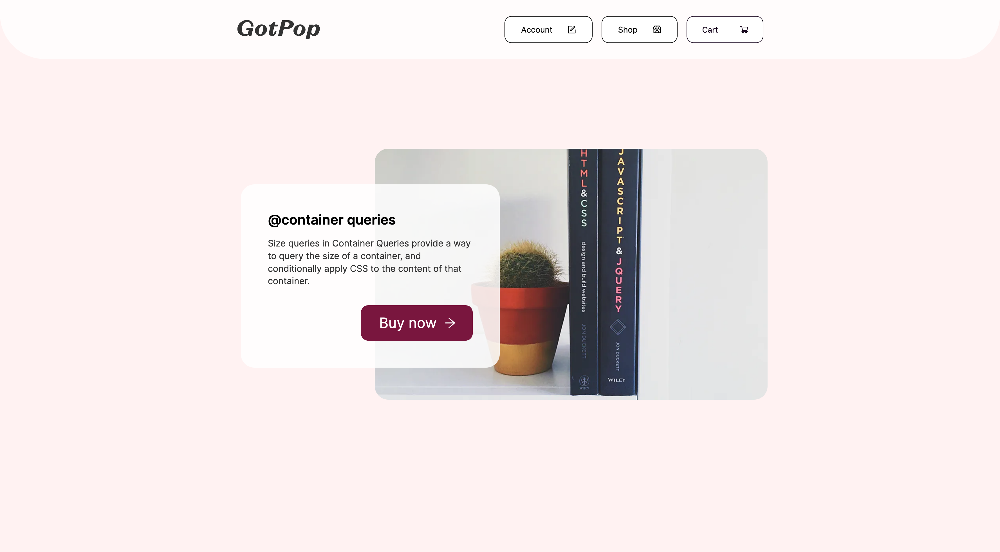

# GotPop Shop

A full stack e-commerce application.

## Project Goals

The initial goal of this application is to demonstrate a Next.js application performing CRUD operations to a PostgreSQL database. I also wanted to create a component system using raw CSS rather than a UI framework to demonstrate website layout with CSS Grid Layout.

## Caveats

This is an ongoing project, right now there's no user login so every user hits the same database user. The next feature will be to add NextAuth.js.

This will open the door to separate carts, wish lists & delivery details etc. The Prisma schema is already set up to allow this.


## Tech Stack

* Next.js (13)
* Raw CSS transpiled with PostCSS
* Prisma
* TypeScript
* PostgreSQL
* Cypress (E2E & component)
* GitHub Actions

## Getting Started

This app was developed with `Node 18`. 

### Local 

First you must set up the `.env` file in order to connect to the database. You can use the starter `.env.sample` located in the root.

```java
DATABASE_URL=DATABASSECRETKEY
```

Once you have the database environment variable set you can install and run the project. If you would like to use your own database you can host them for free at [railway.app](https://railway.app). You can grab the full connection string from the connect tab in the settings page. Building the project should automatically seed the new db.

* `yarn`
* `yarn build`
* `yarn start`

## Environments

| Local | Preview | Live | 
| :--- | :----- | :------ |
| [Localhost](http://localhost:3000) | [Preview](https://gotpop-shop-git-main-teamgotpop.vercel.app) | [Live](https://gotpop-shop.vercel.app)  | 

## Dashboards

| Vercel | Railway |
| :--- | :----- |
| [Dashboard](https://vercel.com/dashboard) | [Dashboard](https://railway.app) |

<h1 align="center">
	
</h1>
