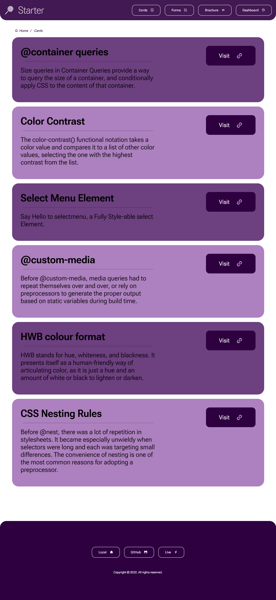

# GotPop Starter

A Next.js starter template.

<h1 align="center">
	                                      <svg
                                    width="76"
                                   height="65"
                              viewBox="0 0 76 65"
                  fill="none" xmlns="http://www.w3.org/2000/svg"><path
            d="M37.5274 0L75.0548 65H0L37.5274 0Z" fill="#ffffff"/></svg>
</h1>

## Live example

https://gotpop-starter.vercel.app

<h1 align="center">
	
</h1>

## Local

http://localhost:3000

## Vercel

https://vercel.com/dashboard

